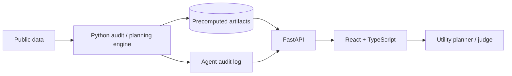
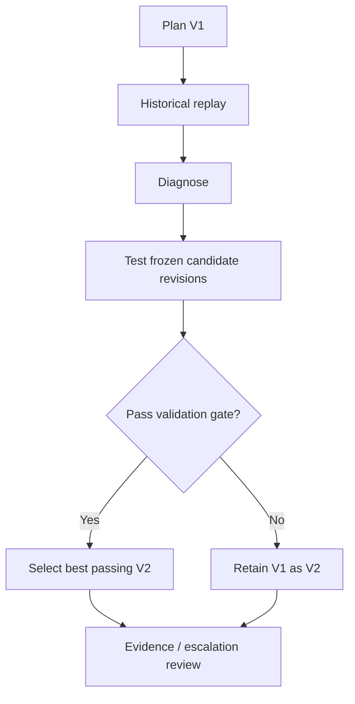

# Pipe Dreams

**Autonomous water-main inspection planning and audit agent**

Pipe Dreams helps municipal water-utility teams decide which water-main assets deserve attention first when inspection capacity is limited and the available evidence is incomplete.

It does not claim to predict every failure or automatically authorize repair. It:

1. associates historical break events with physical pipe assets;
2. generates an initial inspection-priority plan (**Plan V1**);
3. evaluates that plan against historical outcomes;
4. tests a bounded set of predeclared candidate revisions;
5. accepts only revisions that pass a frozen validation gate;
6. produces **Plan V2** — or retains V1 if no candidate earns adoption;
7. exposes weak evidence, unresolved risk, and escalation needs for human review.

> **Differentiator:** Other tools rank pipes; Pipe Dreams audits its own ranking against history and shows which recommendations it cannot responsibly resolve from the available evidence.

---

## Hackathon Context

- **Event:** IEEE Southern Alberta Section Young Professionals Industry Hackathon 2026
- **Theme:** Autonomous Intelligence for Industrial Innovation
- **Stream:** Energy & Infrastructure Systems
- **Path:** Option B
- **Case:** Case 8 — *Which water mains should we repair first?*
- **Team:** Pipe Dreams
- **Submission deadline:** Sunday, Oct. 4, 2026 at 12:00 PM MDT
- **Pitch:** 5 minutes + 3 minutes Q&A

Pipe Dreams preserves the Case 8 **baseline → plan → score → revise** structure while extending it from rounded break-location cells to physical asset planning, historical validation, evidence-quality auditing, and explicit escalation.

---

## Problem Statement

Municipal water utilities can inspect only a fraction of their network, while the evidence available for prioritization is incomplete and uneven. Break-history rankings can miss consequential assets, and a ranked list alone does not reveal which recommendations are well-supported, uncertain, or being deferred.

For this prototype, the operational action is:

> **Prioritize assets for inspection, condition assessment, or engineering review in support of repair and renewal decisions.**

Pipe Dreams does **not** automatically authorize replacement or repair.

---

## Solution

Pipe Dreams is an autonomous water-main planning and audit system. It:

- maps historical breaks to physical water-main assets;
- computes a transparent likelihood / priority signal;
- produces Plan V1 under a fixed planning budget;
- replays that policy across historical validation periods;
- tests a small, frozen menu of revisions;
- accepts or rejects revisions using a predeclared validation gate;
- produces Plan V2 or retains V1;
- separates **Priority** from **Evidence Confidence**;
- exposes escalation and not-covered cases for human review.

### Priority vs Evidence Confidence

- **Priority:** how strongly the frozen planning policy says the asset deserves attention.
- **Evidence Confidence:** how complete, stable, and trustworthy the evidence behind that recommendation is.

Evidence confidence is not a failure probability.

---

## Architecture

Pipe Dreams uses a monorepo with a React + TypeScript frontend, a thin FastAPI backend, and the existing Python audit/model engine.



### Important boundary

**FastAPI does not replace the model or audit engine.**

FastAPI is the HTTP layer between the browser and the Python artifacts / engine. Heavy geospatial matching, backtesting, model evaluation, and frozen-policy scoring remain Python code and are precomputed for demo reliability.

---

## Tech Stack

| Layer | Choice |
|---|---|
| Frontend | React + TypeScript + Vite |
| UI | CSS / lightweight component primitives |
| Charts | Recharts |
| Map | MapLibre GL / React map wrapper with no-basemap fallback |
| Backend | FastAPI + Pydantic |
| Python runtime | Python 3.11 |
| Data | pandas, NumPy |
| Geospatial | GeoPandas, Shapely, PyProj |
| Modeling | scikit-learn |
| Statistics | SciPy where needed |
| Artifact interchange | Parquet, CSV, JSON, JSONL |
| Frontend testing | Vitest |
| Backend testing | pytest |
| Python lint/format | Ruff |

See [`docs/TECH_STACK.md`](./docs/TECH_STACK.md) for rationale and constraints.

---

## Repository Structure

```text
pipe-dreams/
├── README.md
├── AGENTS.md
├── CONTRIBUTING.md
├── .gitignore
├── .env.example
├── config/
│   └── policy_config.DRAFT.yaml
├── docs/
│   ├── ARCHITECTURE.md
│   ├── DECISIONS.md
│   ├── TECH_STACK.md
│   ├── EXPERIMENT_PROTOCOL.md
│   ├── API_CONTRACT.md
│   ├── ARTIFACT_SCHEMAS.md
│   ├── RUBRIC_TRACEABILITY.md
│   ├── BUILD_PLAN.md
│   └── DATA_SOURCES.md
├── engine/          # offline Python engine (matching, model, agent) → writes artifacts/
├── backend/
│   ├── app/
│   ├── tests/
│   └── pyproject.toml
├── frontend/
│   ├── src/
│   ├── package.json
│   └── vite.config.ts
├── artifacts/       # engine output, read by the API (synthetic/ fixtures committed)
├── data/            # raw downloads (git-ignored)
└── scripts/
```

---

## Core Autonomous Loop



The controller is deterministic and bounded. LLMs are not used for risk scoring, policy selection, or revision acceptance.

---

## Current Frozen Direction

Resolved:

- planning unit: **raw public GIS segment**;
- V1: full history, no recency decay, per-asset ranking;
- recency grid: `none`, `hl10`;
- candidate revisions:
  - C1 — `2000_plus`;
  - C2 — `hl10`;
  - C3 — per-metre normalization;
  - C4 — `2000_plus + hl10`;
- rolling validation origins: 2013, 2016, 2019;
- final corrected test: cutoff 2022 → outcomes 2023–2025;
- validation gate: mean capture across 1/2/5/10% length budgets, ≥2/3 origin wins, improvement ≥1 pooled 1-km spatial-block-bootstrap SE;
- organizer rounded-cell baseline: event-capture comparison only;
- 2026 YTD: directional relative-lift confirmation only.

Still required before the corrected final test:

1. derive evidence-confidence thresholds from validation data only;
2. remove all remaining placeholders from the frozen config;
3. hash the config;
4. commit and tag the frozen configuration;
5. then run the corrected final evaluation once with no post-result tuning.

---

## Running the Backend

Python 3.11. Run from the repo root (Windows paths shown; on macOS/Linux use `python3.11` and `backend/.venv/bin/python`).

```bash
py -3.11 -m venv backend/.venv
backend/.venv/Scripts/python -m pip install -e "backend[dev]"

# serve the committed synthetic artifacts on http://localhost:8000
cd backend
.venv/Scripts/python -m uvicorn app.main:app --reload --port 8000

# tests and lint (from backend/)
.venv/Scripts/python -m pytest -q
.venv/Scripts/python -m ruff check . ../scripts
```

- Settings (environment): `PIPE_DREAMS_ARTIFACT_DIR` (default `artifacts/synthetic`, relative to the repo root) and `PIPE_DREAMS_CORS_ORIGINS` (JSON list, default `["http://localhost:5173"]`).
- To point the frontend at the live API, set `VITE_API_BASE_URL=http://localhost:8000` and `VITE_USE_FIXTURES=false`.
- OpenAPI docs: http://localhost:8000/docs. Health: `GET /api/health`.
- Regenerate synthetic artifacts: `backend/.venv/Scripts/python scripts/make_synthetic_artifacts.py`. Validate any artifact directory: `backend/.venv/Scripts/python scripts/validate_artifacts.py <dir>`.
- Real engine output: see [`docs/ENGINE_HANDOFF.md`](./docs/ENGINE_HANDOFF.md).

---

## Documentation

- [`docs/ARCHITECTURE.md`](./docs/ARCHITECTURE.md) — authoritative software design.
- [`docs/DECISIONS.md`](./docs/DECISIONS.md) — why major choices were made.
- [`docs/TECH_STACK.md`](./docs/TECH_STACK.md) — frozen technology choices and rejected alternatives.
- [`docs/EXPERIMENT_PROTOCOL.md`](./docs/EXPERIMENT_PROTOCOL.md) — authoritative validation methodology.
- [`docs/API_CONTRACT.md`](./docs/API_CONTRACT.md) — frontend/backend contract.
- [`docs/ARTIFACT_SCHEMAS.md`](./docs/ARTIFACT_SCHEMAS.md) — engine-to-API artifact contract.
- [`docs/ENGINE_HANDOFF.md`](./docs/ENGINE_HANDOFF.md) — how engine artifacts are validated and served by the API.
- [`docs/RUBRIC_TRACEABILITY.md`](./docs/RUBRIC_TRACEABILITY.md) — rubric and Case 8 coverage.
- [`docs/BUILD_PLAN.md`](./docs/BUILD_PLAN.md) — work split and definition of done.
- [`docs/DATA_SOURCES.md`](./docs/DATA_SOURCES.md) — dataset provenance and limitations.
- [`AGENTS.md`](./AGENTS.md) — model-agnostic implementation guardrails for any AI coding assistant.

---

## Claims Policy

Allowed only when supported by frozen output:

- measured ranking performance;
- accepted/rejected revisions under the frozen gate;
- relative performance versus named baselines;
- evidence-quality tier under declared rules.

Do not claim:

- exact production failure probabilities;
- automatic repair authorization;
- Calgary's official risk score;
- invented savings;
- that Pipe Dreams would have prevented Bearspaw;
- any unverified Bearspaw asset-rank result.

---

## Development Status

Architecture and methodology are sufficiently defined to build.

The two workstreams can proceed in parallel:

- **audit/model:** corrected validation, gate, final frozen artifacts;
- **app:** React UI + FastAPI artifact API against synthetic or development artifacts.

Only real frozen artifacts may appear in submission screenshots or final claims.
