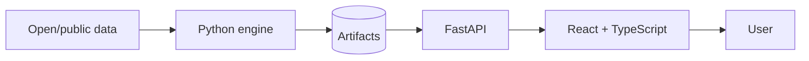
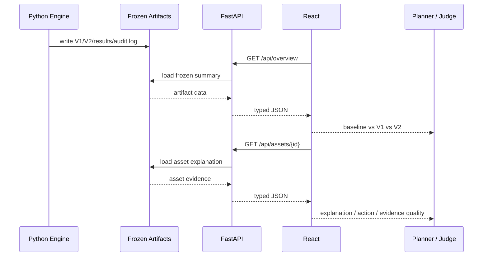

# Pipe Dreams — Architecture

## 1. Purpose

This document is the authoritative software architecture specification for Pipe Dreams.

It defines:
- system boundaries;
- component responsibilities;
- runtime data flow;
- frontend/backend contracts;
- model/audit boundaries;
- state management;
- safety and reliability constraints;
- testing expectations.

Methodological details that determine model-selection validity belong in `EXPERIMENT_PROTOCOL.md`, not here.

---

## 2. Architecture Goals

1. **Make the autonomous decision loop visible.**
2. **Keep the audit/model engine deterministic and reproducible.**
3. **Keep FastAPI thin.**
4. **Keep the React app presentation-focused.**
5. **Precompute heavy geospatial/model work.**
6. **Avoid duplicating domain logic across frontend and backend.**
7. **Let two developers work independently against stable contracts.**
8. **Remain reliable without venue internet.**

---

## 3. Architecture Style

**Monorepo + modular Python backend + React SPA.**

This is not a microservice architecture.



### Why React + FastAPI

The team already has substantial React/TypeScript experience, while neither teammate has production experience with Streamlit.

React provides:
- faster team execution given existing skills;
- stronger control over judge-facing UI;
- reusable map/chart/detail components;
- clean separation between presentation and Python analysis.

FastAPI provides:
- a small typed HTTP boundary;
- Python-native access to Parquet/CSV/JSON artifacts;
- OpenAPI documentation automatically;
- clean frontend/backend separation without rewriting the engine.

---


## 3A. Community-First Decision Architecture

Pipe Dreams uses a two-stage decision process.

### Stage 1: Community Intelligence

The offline Python engine combines:
- Calgary historical water-main break locations;
- public water-main geometry;
- community boundaries;
- population and Calgary Equity Index data, where geographic alignment is reliable.

The new `engine/pipe_dreams_engine/community.py` module owns:
- assigning historical break locations to geographic areas;
- calculating water-main length within each area using clipped line geometry;
- calculating cutoff-safe historical breaks per kilometre;
- reporting geographic coverage and data-quality limitations;
- producing community-level artifacts.

Historical infrastructure burden and current community needs are separate
dimensions. Current equity information must not enter historical predictions
or retrospective model-selection experiments.

Community boundaries and Equity Index census tracts are different geographic
units. Any geographic conversion must use an explicitly documented method.

Community break burden is not an estimate of the number of residents who
would lose service after an individual pipe failure.

### Stage 2: Pipe Intelligence

The existing pipe-level engine remains responsible for:
- time-safe historical break-to-pipe association;
- asset-level evidence and optional spatial-neighbourhood features;
- logistic regression and the frozen V1/C1-C4 policies;
- historical validation and autonomous V2 selection;
- inspection recommendations within available capacity.

Spatial proximity must not be described as verified hydraulic connectivity.
A graph neural network is a potential future extension, not an MVP dependency.

### Decision Presentation

The React application presents communities first and allows users to inspect
the underlying pipe recommendations.

Community analysis and pipe-level model evaluation have independent
validation results. The frontend must not invent a combined risk score.

All heavy computation runs offline. FastAPI serves frozen community and
asset artifacts through separate read-only endpoints.

---
## 4. System Boundaries

### Frontend owns
- presentation;
- interaction;
- filtering;
- selecting assets;
- charts;
- map rendering;
- explaining audit events;
- showing limitations and escalation.

### FastAPI owns
- HTTP contract;
- response validation;
- artifact loading;
- light aggregation / serialization;
- health/readiness;
- returning exactly the frozen data the UI needs.

### Python engine owns
- spatial association;
- historical feature construction;
- model fitting;
- rolling validation;
- baselines;
- block bootstrap;
- revision gate;
- V1/V2 generation;
- data-quality calculations;
- rank-change explanations;
- escalation/not-covered artifact generation.

### FastAPI must not
- re-fit models on page load;
- recompute the historical backtest per request;
- contain a second copy of ranking logic;
- silently alter a frozen plan.

---

## 5. Repository Layout

```text
pipe-dreams/
├── README.md
├── AGENTS.md
├── CONTRIBUTING.md
├── .env.example
├── .gitignore
│
├── config/
│   └── policy_config.DRAFT.yaml
│
├── docs/
│   ├── ARCHITECTURE.md
│   ├── DECISIONS.md
│   ├── TECH_STACK.md
│   ├── EXPERIMENT_PROTOCOL.md
│   ├── API_CONTRACT.md
│   ├── ARTIFACT_SCHEMAS.md
│   ├── RUBRIC_TRACEABILITY.md
│   ├── BUILD_PLAN.md
│   └── DATA_SOURCES.md
│
├── backend/
│   ├── app/
│   │   ├── main.py
│   │   ├── api/
│   │   │   ├── router.py
│   │   │   └── routes/
│   │   │       ├── health.py
│   │   │       ├── overview.py
│   │   │       ├── assets.py
│   │   │       ├── audit.py
│   │   │       └── governance.py
│   │   ├── core/
│   │   │   └── settings.py
│   │   ├── schemas/
│   │   └── services/
│   │       └── artifact_service.py
│   ├── tests/
│   └── pyproject.toml
│
├── engine/                      # offline: writes artifacts; heavy work never runs in API requests
│   ├── pipe_dreams_engine/
│   │   ├── matching.py
│   │   ├── evidence.py
│   │   ├── model.py
│   │   ├── planner.py
│   │   ├── evaluation.py
│   │   ├── agent.py
│   │   └── governance.py
│   └── tests/
│
├── frontend/
│   ├── src/
│   │   ├── components/
│   │   ├── pages/
│   │   ├── lib/
│   │   │   └── api.ts
│   │   ├── App.tsx
│   │   └── main.tsx
│   ├── package.json
│   ├── tsconfig.json
│   └── vite.config.ts
│
├── artifacts/                   # handoff point: engine writes, API reads
│   ├── .gitkeep
│   └── synthetic/               # committed fixtures for UI/API dev (synthetic=true)
│
├── data/                        # raw downloads, git-ignored
└── scripts/
```

---

## 6. Data and Control Flow



---

## 7. Engine and Backend Modules

Engine modules live in top-level `engine/pipe_dreams_engine/` and run offline to produce artifacts. The FastAPI backend reads artifacts through `services/artifact_service.py`. For the core MVP, FastAPI reads precomputed artifacts only and never imports engine code. After the core demo is stable, the optional `POST /api/scenarios/capacity` may call pure planner/governance functions; heavy matching, training and backtesting never run at request time.

### `engine/pipe_dreams_engine/matching.py`
Responsibilities:
- projected point-to-line matching;
- distance/gap metadata;
- temporal attribution safeguards;
- ambiguity flags.

### `engine/pipe_dreams_engine/evidence.py`
Responsibilities:
- cutoff-safe features;
- evidence-basis labels;
- evidence-confidence component values.

### `engine/pipe_dreams_engine/model.py`
Responsibilities:
- count baseline;
- logistic regression;
- comparison model where retained;
- time-safe training/prediction.

### `engine/pipe_dreams_engine/planner.py`
Responsibilities:
- create V1/candidate plans;
- enforce Top-N or network-length capacity;
- assign deterministic ranking.

### `engine/pipe_dreams_engine/evaluation.py`
Responsibilities:
- rolling-origin replay;
- capture metrics;
- baseline comparisons;
- block bootstrap;
- candidate-vs-V1 gate inputs.

### `engine/pipe_dreams_engine/agent.py`
Responsibilities:
- bounded state machine;
- test frozen candidates;
- accept/reject;
- select best passing V2;
- produce `agent_log.jsonl`.

### `engine/pipe_dreams_engine/governance.py`
Responsibilities:
- evidence-confidence tiers;
- VERIFY / ESCALATE / DEFER rules;
- not-covered records.

### `services/artifact_service.py`
Responsibilities:
- read artifacts;
- validate expected files;
- cache safe read-only data;
- expose typed data to routes.

No ranking/model logic belongs here.

---

## 8. API Layer

Base path:

```text
/api
```

Core routes:

```text
GET /api/health
GET /api/overview
GET /api/assets
GET /api/assets/geojson
GET /api/assets/{asset_id}
GET /api/rank-changes
GET /api/audit
GET /api/escalations
GET /api/not-covered
GET /api/data-quality
```

Optional after core is stable:

```text
POST /api/scenarios/capacity
```

Only add a write/replan endpoint if it can reuse frozen/precomputed policy logic without rerunning the audit.

Detailed response shapes belong in `API_CONTRACT.md`.

---

## 9. Frontend Architecture

### Pages / major views

1. **Decision Overview**
   - baseline vs V1 vs V2;
   - fixed evaluation budgets;
   - uncertainty;
   - selected revision.

2. **Network Map**
   - selected assets;
   - evidence-confidence display;
   - consequence / action display;
   - no-basemap fallback.

3. **Agent Audit**
   - PLAN_V1;
   - EVALUATE;
   - DIAGNOSE;
   - TEST_CANDIDATE;
   - ACCEPT / REJECT;
   - PLAN_V2.

4. **Asset Detail**
   - rank/action before and after;
   - evidence basis;
   - priority drivers;
   - limitations.

5. **Escalation**
   - in-dataset assets requiring review.

6. **Not Covered**
   - missing asset classes/evidence the prototype cannot responsibly rank.

### Frontend rule

The React app must never calculate the risk score independently.

It displays backend-provided frozen results.

---

## 10. Runtime State

No database for MVP.

State sources:
- Parquet;
- CSV;
- JSON;
- JSONL;
- frozen YAML config.

React state:
- UI-only state such as selected asset, active filters, tabs, capacity display.

FastAPI:
- stateless except safe in-memory caching of loaded artifacts.

---

## 11. Synthetic Data Safety

During parallel development, synthetic artifacts are permitted.

The backend exposes whether artifacts are synthetic.

The frontend must show a persistent:

> **SYNTHETIC / PLACEHOLDER DATA**

banner if:
- `audit_summary.synthetic == true`, or
- `config_hash == "PLACEHOLDER"`.

Synthetic outputs must never appear in submission screenshots.

---

## 12. CORS and Local Development

Frontend:
- `http://localhost:5173`

Backend:
- `http://localhost:8000`

FastAPI CORS:
- allow the configured frontend origin only in development.

No wildcard CORS is needed.

---

## 13. Reliability

Demo reliability matters more than architecture complexity.

Requirements:
- heavy analysis precomputed;
- backend starts locally with no external cloud dependency;
- frontend can render meaningful output if basemap tiles fail;
- screenshots and backup demo recorded;
- artifact loader fails loudly on malformed/missing files.

---

## 14. Testing

### Backend
- temporal attribution;
- candidate cutoff;
- no post-cutoff features;
- budget accounting;
- revision gate acceptance;
- revision gate rejection;
- artifact schema validation;
- synthetic flag behavior;
- API health;
- API response-schema smoke tests.

### Frontend
- API client;
- synthetic banner;
- overview rendering;
- agent decision rendering;
- empty/error state;
- rank-change cards.

---

## 15. Production Evolution

A real utility pilot would replace prototype public-data approximations with:
- verified asset IDs;
- work orders;
- historical asset registry;
- inspection/condition data;
- official consequence/criticality;
- operational planning constraints.

Only then consider:
- persistent DB;
- authentication / RBAC;
- worker/background jobs;
- utility-specific connectors;
- cloud deployment.

These are not hackathon requirements.

---

## 16. Known Limitations

- present-day pipe network does not reconstruct all historical assets;
- nearest-line association is an approximation;
- historical reachable share changes by era;
- final test window was viewed once before the corrected audit;
- 3-year horizon is a prototype choice;
- consequence proxy is incomplete;
- confidence tiers may remain evidence-quality labels only;
- segment fragmentation can affect per-metre ranking;
- no claim is made that Pipe Dreams is Calgary's official risk model.
